# SPRING PLUS 13단계 조회성능개선
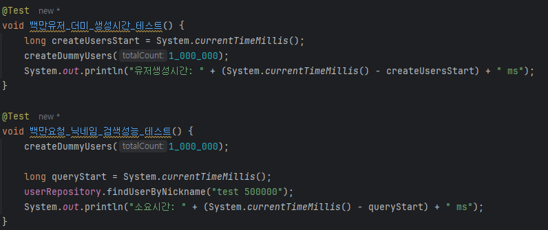
- 유저생성시간
- 조회 소요시간

이렇게 두가지로 나누어 성능개선 연습을 하였습니다.
자세한 내용은 [블로그(클릭)](https://ung9776.tistory.com/82)를 통해 확인할 수 있습니다.

# 유저생성
## Save -> SaveAll
### Save 사용
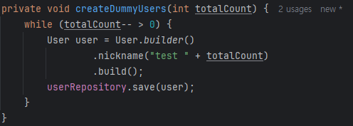 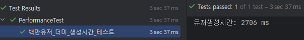
### SaveAll 사용
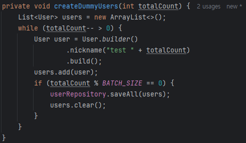 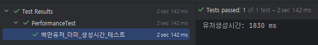
---
# 조회
## 닉네임에 인덱스 부여
### 기존방식 type = ALL
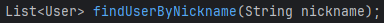 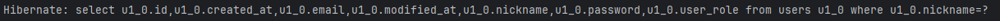
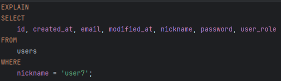 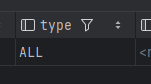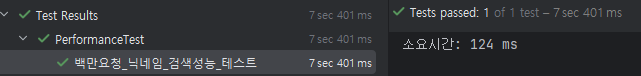
### 개선된 방식 type = ref
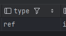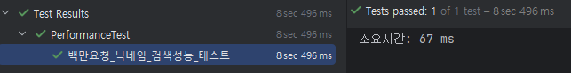

2배가량 속도가 빨랐다..!